Opgaven for integrationen er at stille oplysninger om kunder, aftaler, installationer og deres respektive adresser til rådighed i Dynamics CRM 365 som de forefindes i KMD EE.

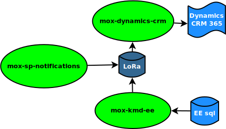

Grunddata kommer fra KMD EE, hvor data forefindes i delvist manuelt indtastet form, der kan derfor være intastninger af fx. adresser, som gør det svært at genfinde en unik dansk adresse der passer.

**mox-kmd-ee**

Data for kunder overføres fra KMD_EE med udgangspunkt i tabellerne 'kunde' og 'forbrugssted' som et kundeforhold med både forbrugsstedsadresse og faktureringsadresse. CPR og CVR kunder kommer pakket ind i samme datastruktur, som skilles ad ved overførsel til LoRa, hvor:

* cpr-kunder bliver til organisation/bruger 
* cvr-kunder bliver til oranisation/organisation
* aftaler bliver til indsats/indsats
* kunderoller bliver til organisation/organisationfunktion
* kundeforhold bliver organisation/interessefaellesskab

Data for installationer overføres KMD_EE med udgangspunkt i tabellerne 'trefistallation' og 'trefmaaler' og bliver til klassifikation/klasse i LoRa

**mox-dynamics-crm**

Data overføres til Dynamics CRM 365 til tabellerne 'ava_aftales', 'contacts', 'ava_kunderolles', 'ava_aftales' og 'ava_installations', men gemmes først i et cachelag som anvendes til dels kun at overføre poster, der er ændret, dels til at sikre at der opbevares krydsreferencer til posterne i LoRa og Dynamics CRM.

**mox-sp-notifications**

Data, som ikke længere overføres fra KMD EE på grund af uaktualitet vil gravist miste kvalitet i LoRa og dermed Dynamics CRM på grund af at kunder er fraflyttet de registrerede adresser. Mox-sp-notifications sørger for at disse rettelser alligevel kommer med i LoRa og dermed op i Dynamics CRM.

Mox-kmd-ee
----------

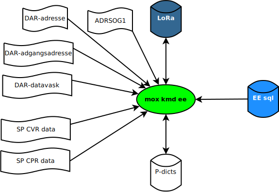

**mox-kmd-ee** anvender sin egen cache (P-dicts) til at afgøre, hvorvidt en nys overført post er ny, ændret eller uændret.
Hvis der er tale om en ny post dannes nye poster i LoRas tabeller. Hvis posten er opdateret, vil tilsvarende poster i LoRa blive opdateret og eventuelt nye oprettet.

Udover oprettelse af korresponderende poster i Lora bruges mox_kmd_ee-kørslen til at finde unikke referencer til adresser og til at komplettere personnumre fra KMD EE, der mangler de sidste 4 cifre.

Komplettering af cpr-numre
~~~~~~~~~~~~~~~~~~~~~~~~~~

Når kundedata fra et sqlopslag kommer ind i **mox-kmd-ee**, opgraderes posterne med det fulde cpr-nummer, som fås ved opslag i ADRSOEG1 på baggrund af faktureringsadresse eller adgangsadresse. Kan CPR-nummeret ikke slås op her, afvises posten. Denne øvelse er afstedkommet af at de sidste 4 cifre er blevet taget af cprnummeret hos nye kunder efter GDPR's igangsætning.

Fremgangsmåden er følgende:

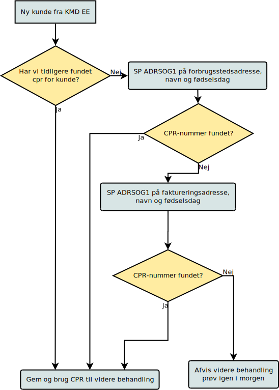

Figuren ovenfor viser selve kundens opslag. Er der tale om en ligestillingskunde er fremgangsmåden lignende, her ses blot kun på den adresse, som kunden selv blev fundet på, ligesom der her kun kan slås op på adresse og fødselsdato.

Opslag af dawa-uuid (adresse-id) for faktureringsadresse
~~~~~~~~~~~~~~~~~~~~~~~~~~~~~~~~~~~~~~~~~~~~~~~~~~~~~~~~

Adresser kommer som strenge, gadenavne og gadenumre fra KMD-EE. For at få en entydig identifikation slås adresser derfor op i dawa.

Da CPR-nummeret er kompletteret med de sidste 4 cifre inden kunden 'får lov' at komme ind i LoRa kan vi nu anvende det til at slå adressen op på Serviceplatformen (SP).
For CVR-kunder kan vi være heldige at få dawa-uuid'et direkte, ellers gøres som for cpr-kunder: man slår adressen op i dawa på baggrund af de data, man har fået fra SP.

Fremgangsmåden er følgende:

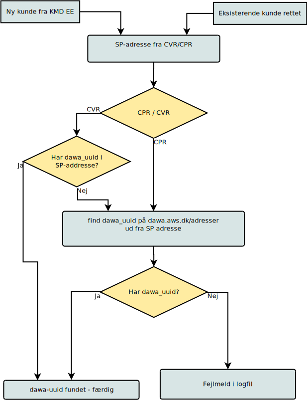

Opslag af dawa-uuid (adresse-id) for forbrugsstedsadresse
~~~~~~~~~~~~~~~~~~~~~~~~~~~~~~~~~~~~~~~~~~~~~~~~~~~~~~~~~

Forbrugsstedsaddressen findes udfra de adressekomponentfelter, der er overført fra KMD EE og kan findes i et af tre opslag: adresser, datavask-addresser eller adgangsadresser.

Fremgangsmåden er følgende.

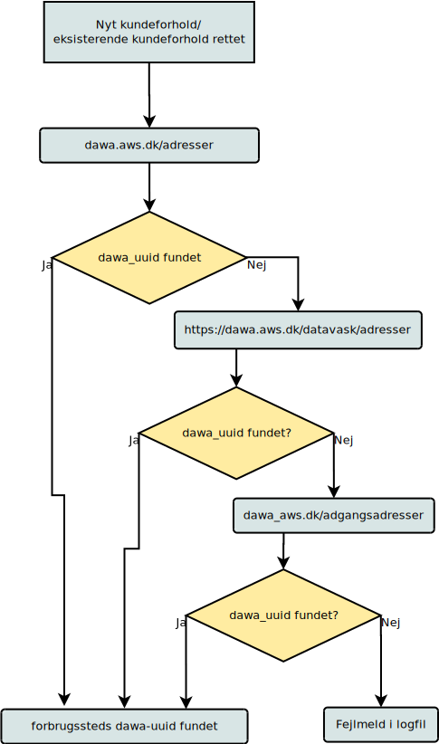

Mox-dynamics-crm
----------------

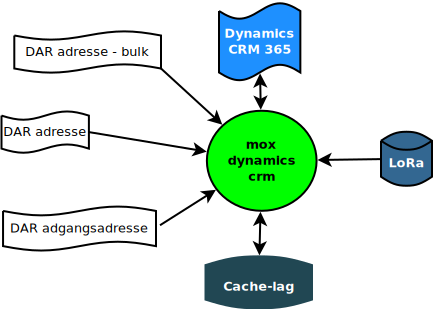

Denne **MOX** har to selvstændige kørsler

**import**, som henter alle adresser fra Århus ind i cachelaget og importerer samtlige gældende poster fra lora ind i cachelaget

**export**, som overfører alle ændrede og nye poster fra cachelaget til Dynamics CRM 365.

Mox-dynamics-crm import
~~~~~~~~~~~~~~~~~~~~~~~

Import-kørslen henter adresser og LoRa-indhold til cachelaget i denne rækkefølge. Fejl rapporteres i logfil.

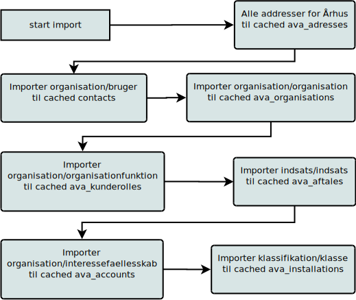

Mox-dynamics-crm export
~~~~~~~~~~~~~~~~~~~~~~~

Eksport kørslen tager udgangspunkt i en kunderolle og kører følgende sekvens igennem for hver kunderolle, uanset om den er ny, ændret eller uændret.  

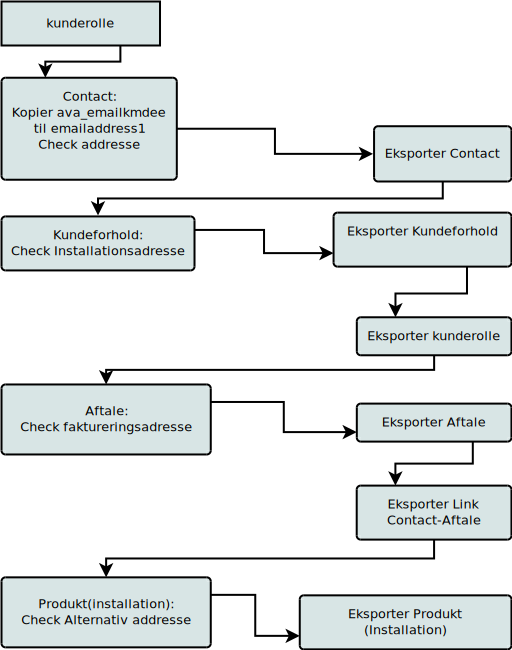

Ovenstående beskriver i store træk sekvensen i eksporten. De trin, der står i kasserne til højre (Eksporter) har alle det til fælles, 
at de kun overfører, hvis noget er ændret i seneste overførsel fra LoRa. 

Export af contact
~~~~~~~~~~~~~~~~~

Som eksempel på export vises Contact, men fremgangsmåden er lignende for alle de entiteter, der overføres til Dynamics CRM 365.

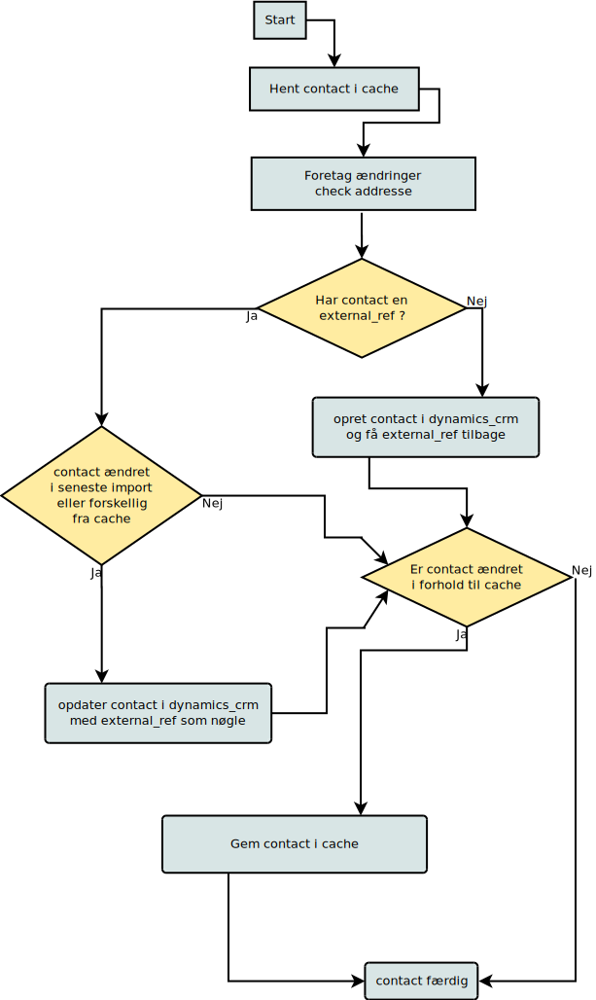

Der foretages check af samtlige adresser i overførslen fra cachelag til crm. Adresser kan ligge udenfor Århus kommune, og derfor hjælper det os ikke
at alle Århus' adresser ligger i cachelaget. Vi må hente de, som mangler.

Check af installations-adresse
~~~~~~~~~~~~~~~~~~~~~~~~~~~~~~

Som eksempel på check af adresse visses check af installations-addresse, som er den mest komplicerede. Her vises den del, der vedrører adressen, som er markeret på kundeforholdet.

Hvis der findes en alternativ adresse på selve installationen, forsøges den fundet i adgangsadresser.

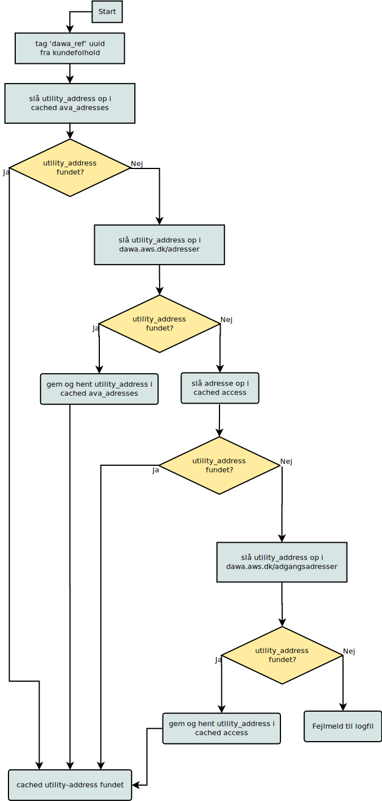

Når en adresse er fundet gennemløber den samme logik som andre exports - den checkes for external_ref, hvorefter den indsættes eller opdateres i dynamics_crm eller ignoreres alt efter om den er ny, ændret eller uændret.

Mox-sp-notifications
--------------------

Denne kørsel løber samtlige brugere og organisationer i LoRa igennem og checker dem for ændringer i forhold til Serviceplatformens oplysninger. 

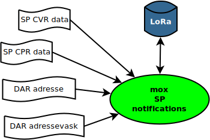

Procedure for en bruger
~~~~~~~~~~~~~~~~~~~~~~~

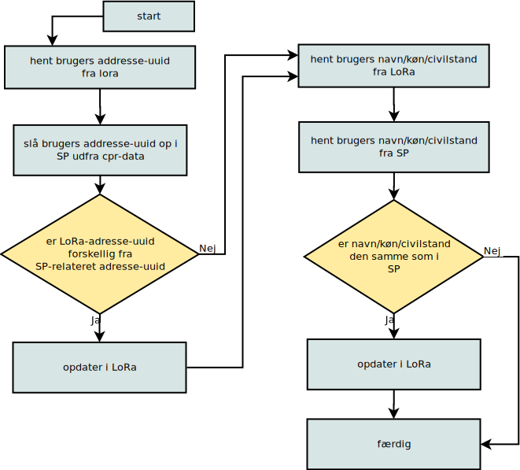

Her er vist gennemløbet af en bruger. For en organisation er fremgangsmåden lignende, blot checkes der for organisationen følgende i stedet:

 * adresse_uuid
 * organisationsnavn
 * virksomhedskode
 * virksomhedstype

